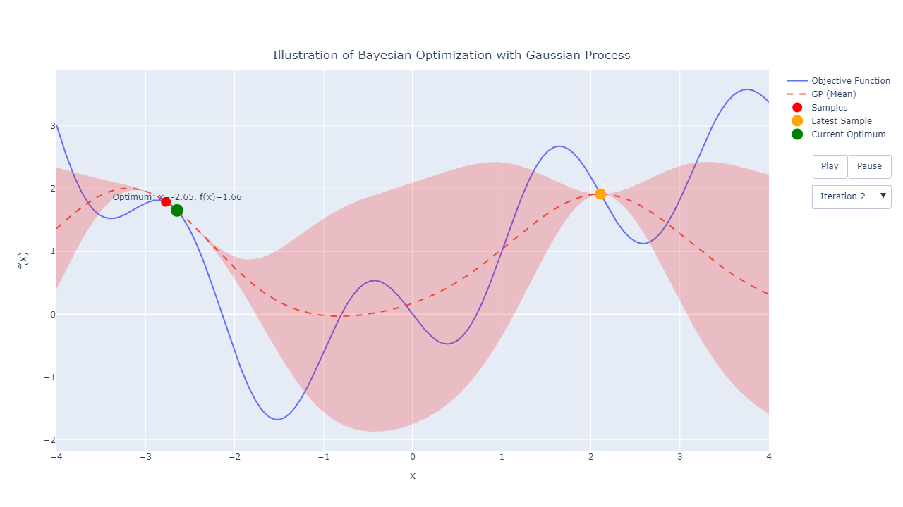

# Bayesian Optimization Illustration

This repository demonstrates Bayesian Optimization from scratch in Python using a **Gaussian Process** as a surrogate model and **Expected Improvement (EI)** as the acquisition function.

An animated visualization using Plotly shows how the optimization evolves over iterations.



## 🚀 Features

- Custom implementation of Gaussian Process Regression
- Radial Basis Function (RBF) kernel
- Expected Improvement acquisition strategy
- Optimization using `scipy.optimize.minimize`
- Animated visualization of the optimization process using Plotly
- Highlight of current best (optimum), latest sample, and uncertainty area

## 📦 Requirements

Install dependencies via pip:

```bash
pip install numpy scipy plotly
```

## 📂 Files

- `bayesian_optimization.py` – The full Python script implementing Bayesian Optimization and generating the animation
- `bayesian_optimization_animation.html` – Output HTML animation (generated after running the script)

## ▶️ How to Run

```bash
python bayesian_optimization.py
```

This will create and open `bayesian_optimization_animation.html` in your default browser.


## 📄 License

MIT License

## 🧠 Credits

Built by [Cahya Alkahfi](https://sainsdata.id/author/ca_alkahfi/)
